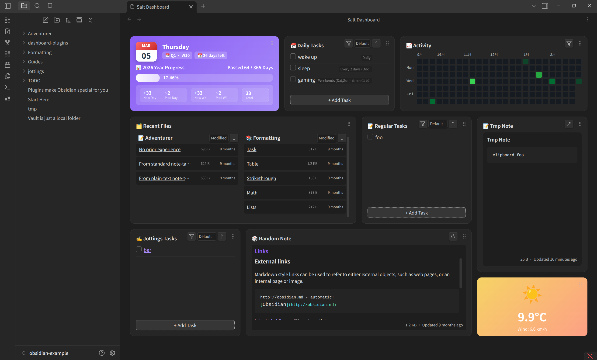

# Obsidian Salt Dashboard

English|[中文](README-zh.md)

Welcome to Salt Dashboard! This is a responsive dashboard plugin for Obsidian. It provides an intuitive grid layout to help you quickly view dates, tasks, recent files, and your contribution graph.



## Installation (via BRAT)

The plugin is currently in development. You can install it using the BRAT plugin.

1. Open Obsidian and go to Community Plugins.
2. Search for and install the **Obsidian42 - BRAT** plugin.
3. Enable BRAT.
4. Go to BRAT's settings and click **Add Beta plugin**.
5. Enter this repository's URL (`Kuro96/obsidian-salt-dashboard`).
6. Click Add. BRAT will download and install the plugin.
7. Go back to your Obsidian plugin list, find **Salt Dashboard**, and enable it.

## Configuration

Once enabled, go to the plugin settings to customize your dashboard.

**Global Settings:**

- **Open on Startup**: Check `Open Dashboard on Startup`. The dashboard will open automatically every time you launch Obsidian.
- **TODO Source Folder**: Set your `TODO Source Folder`. All your task files will be saved here.
- **Global Filter**: Use `Global Filter` to exclude unwanted files. It uses a Dataview-style query syntax. For example, `(-"Templates")` hides files in your Templates folder.

**Module Toggles:**
You can easily toggle specific modules on or off in the settings. When a module is turned off, its specific configuration options will hide automatically to keep things clean.

## Daily Usage

You can open the dashboard manually by pressing `Ctrl/Cmd + P` and running the `Salt Dashboard: Open Dashboard` command. You can also click the dedicated icon in the left ribbon.

**Layout Adjustments:**

- **Drag Modules**: Click and hold the **Grip Icon** at the top right of any module to move it. We restricted dragging to this handle only, so you won't accidentally drag a module when you just want to select text.
- **Resize Modules**: Hover over the edges or the bottom right corner of a module, then click and drag to resize it.
- **Reset Layout**: If you mess up your layout, just go to settings and click `Reset to Default Layout` to restore the default look.

**Built-in Modules:**

1. **Date Progress**: See today's date and track your year/week progress. You can also enable vault stats to see how many notes you created or modified today.
2. **Contribution Graph**: A GitHub-style heatmap. It gives you a clear view of your daily task completions. Click a block to see the tasks for that specific day.
3. **Todo Modules**:
   - **Daily Todo**: Best for recurring habits (like taking pills or reading). It includes a simple crontab editor so you can define which days a task appears.
   - **Regular Todo**: Best for daily task lists. You can check off or abandon tasks right on the dashboard. The plugin updates the source file automatically.
   - **Jottings Todo**: Captures special task links scattered across your vault. Perfect for quick ideas.
4. **Recent Files**: Displays your recently modified or created notes in columns. You can add columns and set specific filter rules for each.
5. **Random Note**: Shows a preview of a random past note. Good for reviewing old ideas.
6. **Tmp Note**: A sticky scratchpad on your dashboard. Quick and easy for temporary text.

## More Documentation

For detailed configurations, architectural decisions, and a comprehensive user guide, please refer to the files in the [`docs/`](docs/) directory:

- [User Guide](docs/user-guide.md)
- [Architecture](docs/architecture.md)
- [How to Write a Custom Plugin](docs/how-to-write-a-gist-plugin.md)

## How to Write Custom Plugins

Not enough built-in modules? Salt Dashboard lets you write your own plugins using React and JSX!

Thanks to a microkernel design, you just need to set a `Custom Plugin Folder` in the settings. Drop your JSX files there, click `Reload Extensions`, and hot-reload your custom modules.

Here is a quick example using `weather.jsx` to show you how to write a simple weather widget.

Create a `weather.jsx` file with this basic structure:

```jsx
const { useState, useEffect } = React;
const { Setting } = require('obsidian');

// 1. Write your React component
const WeatherCard = () => {
  const [data, setData] = useState(null);

  // Fetch weather API data here
  useEffect(() => {
    fetch(
      'https://api.open-meteo.com/v1/forecast?latitude=35.68&longitude=139.69&current_weather=true'
    )
      .then(res => res.json())
      .then(json => setData(json.current_weather));
  }, []);

  if (!data) return <div>Loading...</div>;

  return (
    <div style={{ padding: '16px', background: '#f6d365', borderRadius: '12px' }}>
      <h2>Weather</h2>
      <p>{data.temperature}°C</p>
    </div>
  );
};

// 2. Export module configuration
module.exports = {
  id: 'weather-gist-card', // Unique module ID
  title: 'Weather Widget', // Module name
  icon: 'sun', // Icon name
  defaultSettings: {
    // Default settings data
    'weather-gist': { lat: '35.68', long: '139.69' },
  },
  defaultLayout: {
    // Default grid size
    w: 4,
    h: 8,
    showTitle: false,
  },
  component: WeatherCard, // Bind the React component
  // 3. (Optional) Render settings UI
  renderSettings: (containerEl, plugin, settings) => {
    containerEl.createEl('h3', { text: 'Weather Settings' });

    const config = settings['weather-gist'];
    new Setting(containerEl).setName('Latitude').addText(text =>
      text.setValue(config.lat).onChange(async v => {
        config.lat = v;
        await plugin.saveSettings();
      })
    );
  },
};
```

After writing this, click the reload button in the dashboard settings. You can now add and see your custom weather card on the grid.
